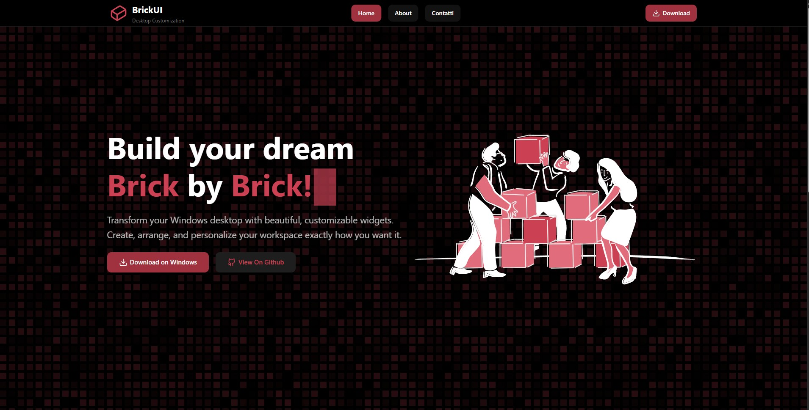

<Header />

= 1 ? 'top-20 left-10 text-left' : 'top-1/2 left-1/2 -translate-x-1/2 -translate-y-1/2'"
>
  <h1 class="text-4xl font-bold transition-all duration-700">
    Alcuni miei Progetti
  </h1>

  

    

      <h2 class="text-3xl font-mono font-bold mb-4">BrickUI</h2>
      

        Un'applicazione che estende l'esperienza desktop di Windows consentendo la creazione di 
        <strong>widget personalizzati</strong>.   Sfrutta il rendering di una 
        <strong>WebView</strong> per integrare elementi grafici dinamici sopra l'interfaccia nativa.
      

    

    

      
    

  

