<Header />

  <h1 class="text-2xl font-bold">
    Alcuni miei Progetti
  </h1>

  

    

      <h2 class="text-3xl font-mono font-bold mb-4">GGsBot.rs</h2>
      

        Bot Discord ad alta scalabilità su architettura serverless. 
        Stateless per natura, comunica tramite un Gateway dedicato, 
        garantendo efficienza, costi ridotti e zero latenza nella gestione degli eventi.
      

    

    

      
    

  

