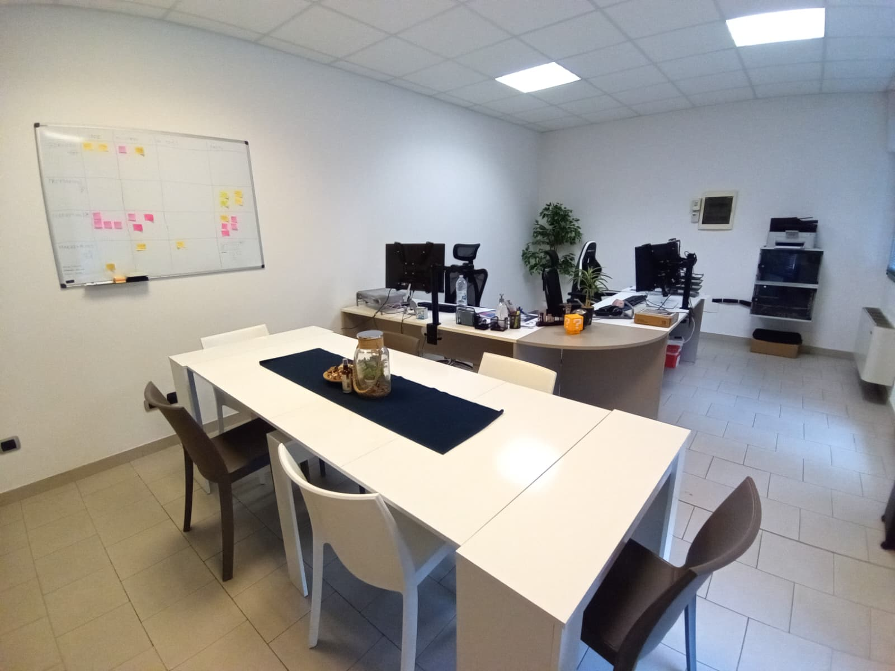

<Header />

= 1 ? 'top-20 left-10 text-left' : 'top-1/2 left-1/2 -translate-x-1/2 -translate-y-1/2'"
>
  <h1 class="text-4xl font-bold transition-all duration-700">
    {{ $clicks >= 1 ? "Dove l'ho svolto?" : "Percorso PCTO" }}
  </h1>

  

    

      <h2 class="text-3xl font-mono font-bold mb-4">
        <a href="https://devcode.it/" target="_blank"><strong>#</strong> DevCode</a>
      </h2>
      

        Ho svolto il mio percorso PCTO presso la software house,
        lavorando a <strong>stretto contatto</strong> con il <strong>team di sviluppo</strong>.   
        L'esperienza ha permesso l'integrazione in un flusso di lavoro professionale, 
        confrontandomi con la gestione di <strong>progetti reali</strong> e consolidando le mie competenze 
        tecniche in un contesto <strong>aziendale dinamico</strong>.
      

    

    

      
    

  

