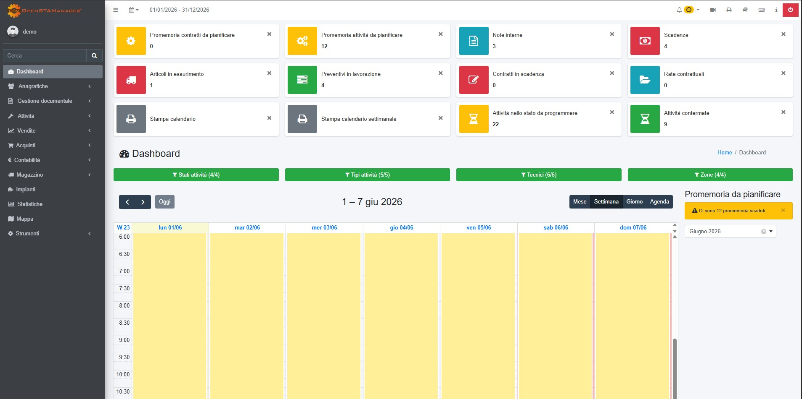

<RemoveTopRightDialog />

<Header />

  <h1 class="text-4xl font-bold transition-all duration-700">
    Il Loro Prodotto
  </h1>

  

    

      <h2 class="text-3xl font-mono font-bold mb-4">
        <a href="https://openstamanager.com/" target="_blank"><strong>#</strong> OpenSTAManager</a>
      </h2>
      

        Un <strong>gestionale open-source</strong> modulare, 
        sviluppato per centralizzare la gestione di <strong>contabilità, magazzini, impianti</strong> e tanto altro. 
          
          
        Grazie a un'<strong>architettura basata su plugin</strong>, il software permette di integrare 
        funzionalità specifiche su misura, adattandosi dinamicamente alle diverse esigenze 
        operative dei clienti.
      

    

    

      
    

  

