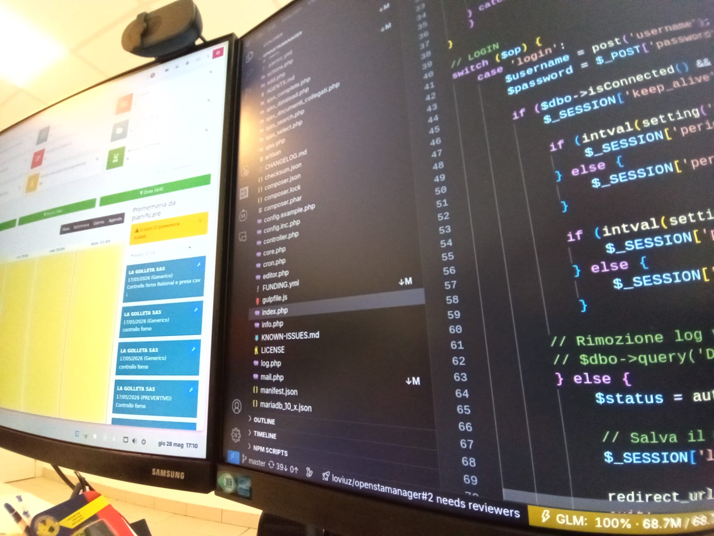

<Header />

= 2
  }"
>
  <h1 class="text-4xl font-bold transition-all duration-700">
    {{ $clicks >= 1 ? 'Cosa ho appreso' : 'Il Mio Ruolo' }}
  </h1>

  

    

      <h2 class="text-3xl font-mono font-bold mb-4">
        <a><strong>#</strong> Automazione Test</a>
      </h2>
      

        Mi sono occupato di potenziare i sistemi di <strong>testing automatizzato</strong>
        del gestionale tramite l'utilizzo di strumenti come Python e Selenium. 
          
        Ho progettato script capaci di simulare le interazioni 
        di un utente reale sul browser, automatizzando 
        la verifica delle procedure e garantendo 
        la <strong>stabilità del software</strong> prima di ogni rilascio.
      

    

    

      
    

  

  

    <h3 class="text-xl font-bold mb-2">
      <a><strong>#</strong> Gestione del Tempo</a>
    </h3>
    

      Ho imparato l'importanza di rispettare rigorosamente le <strong>timeline</strong> e gli orari aziendali, 
      comprendendo come la <strong>puntualità</strong> influisca sulla <strong>produttività</strong> dell'intero team.
    

  

  
  

    <h3 class="text-xl font-bold mb-2"><a><strong>#</strong> Pensiero Analitico</a></h3>
    

      Ho sviluppato la capacità di affrontare bug e <strong>sfide complesse</strong> con metodo, 
      mantenendo la lucidità anche quando la soluzione non è immediata.
    

  

  

    <h3 class="text-xl font-bold mb-2"><a><strong>#</strong> Lavoro di Squadra</a></h3>
    

      Ho affinato la <strong>comunicazione</strong> con il referente per coordinare lo sviluppo, 
      fondamentale per capire come far progredire il lavoro in modo sinergico.
    

  

