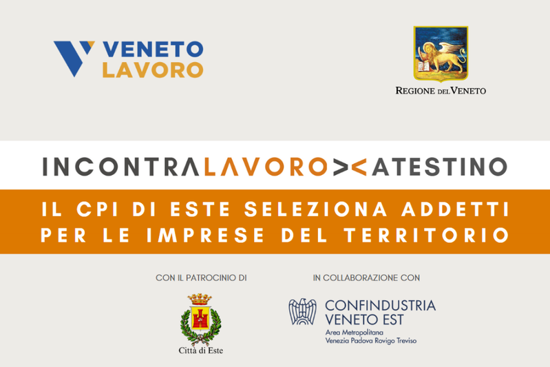

<Header />

= 1 ? 'top-20 left-10 text-left' : 'top-1/2 left-1/2 -translate-x-1/2 -translate-y-1/2'"
>
  <h1 class="text-4xl font-bold transition-all duration-700">
    {{ $clicks >= 1 ? "Il Contesto e le Necessità" : "IncontraLavoro Atestino" }}
  </h1>

= 1" class="fixed top-25 right-15 color-gray-400">
  <b>22 ottobre 2025</b>

  

    

      <h2 class="text-3xl font-mono font-bold mb-4">
        <a href="https://www.cliclavoroveneto.it" target="_blank"><strong>#</strong> CPI - Este (PD)</a>
      </h2>
      

        Ho partecipato al progetto IncontraLavoro Atestino presso il <strong>Centro per l'Impiego</strong> di Este. 
        L'evento ha favorito un confronto diretto tra le <strong>imprese</strong> del territorio e i <strong>candidati</strong>, 
        fungendo da ponte strategico tra domanda e offerta. 
         
         
        Data la natura dell'evento, è stato necessario sviluppare in <strong>tempi rapidi</strong> uno strumento di gestione <strong>intuitivo</strong>, 
        capace di supportare i flussi di lavoro garantendo massima <strong>affidabilità</strong>.
      

    

    

      
    

  

